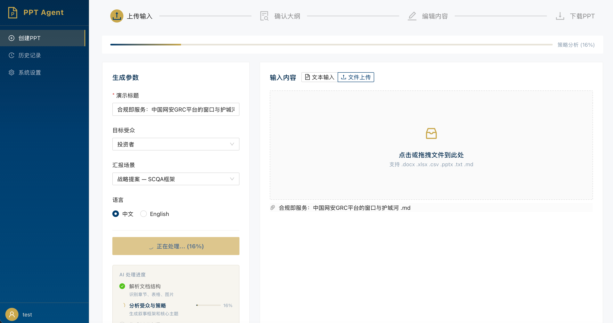
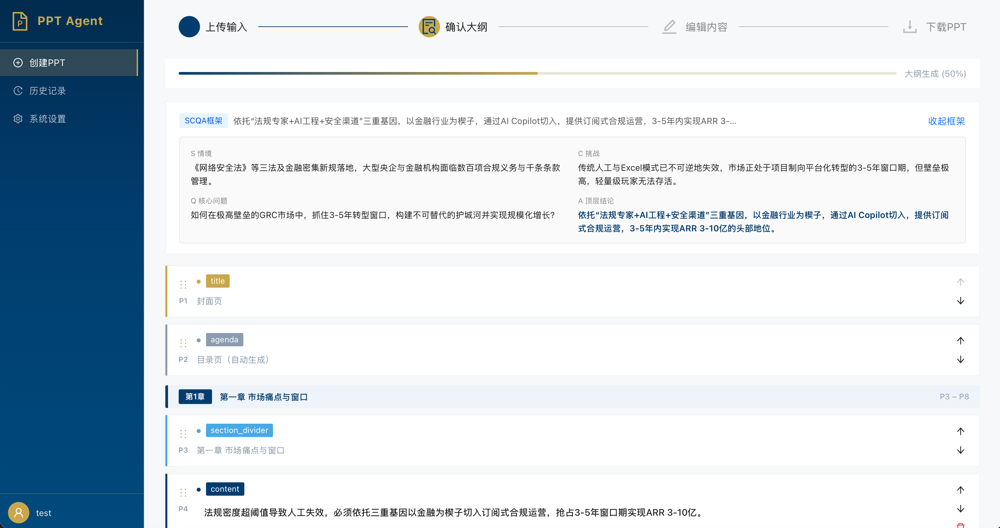
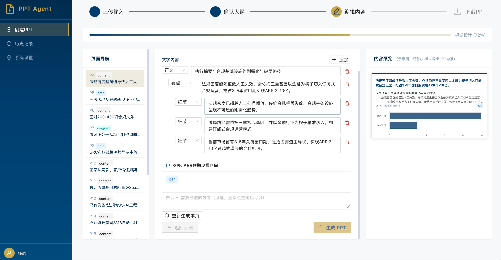
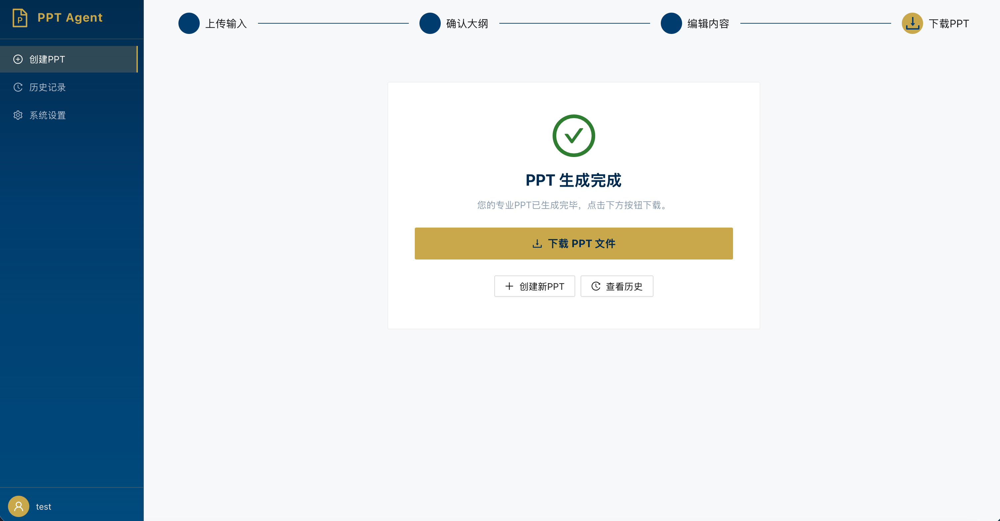
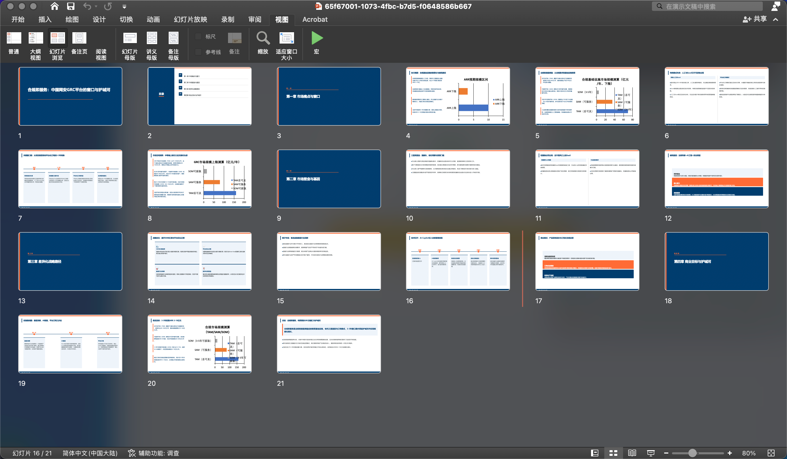

# PPT Agent

输入文本或文档，自动生成咨询级 `.pptx` 演示文稿。

系统对标四大咨询公司的信息密度和视觉规范，强调透明可控：每个关键决策节点暂停，用户审阅确认后再继续。

## 效果预览

### Step 1：上传材料

上传文档（DOCX/XLSX/Markdown/TXT）或直接粘贴文本，选择汇报场景和目标受众。

<p align="center">
  
</p>

### Step 2：审阅大纲

AI 根据场景自动选择叙事框架（SCQA / SCR / AIDA 等），生成论证型大纲。用户可编辑每页的核心观点、调整页序、删除页面。

<p align="center">
  
</p>

### Step 3：审阅内容

每页内容独立生成，右侧实时预览。可编辑文本、修改图表数据、对单页重跑（附反馈）。

<p align="center">
  
</p>

### Step 4：下载 PPT

确认后自动渲染生成 `.pptx`，下载即用。

<p align="center">
  
</p>

### 生成效果

原生矢量图表、专业配色、结构完整——打开即可演示或二次编辑。

<p align="center">
  
</p>

---

## 核心特性

### 信息不丢失

大多数工具在把文章"喂给" LLM 时会大幅压缩，生成出来的 PPT 泛泛而谈。PPT Agent 为每页幻灯片单独注入最相关的原文段落，核心数据、关键结论、具体数字，该出现的都会出现。

### 图表数据来自原文，不是编造的

LLM 生成图表时常会"发明"数字。PPT Agent 的图表数据**强制来源于上传文件中的真实表格**，数字直接从 Excel/CSV 行列中提取，LLM 只负责选择图表类型和写结论，不碰任何数值。

### 原生矢量图表，不是截图

生成的图表是 PowerPoint **原生图表对象**——可以直接点击修改数据、换颜色、调字体，和手工插入的图表没有区别。缩放不失真，支持二次编辑。

### 流水线透明，每步可审阅

6 个 Agent 串行执行，每个 Agent 的输出都持久化并暴露给用户：
- 看到 AI 理解了哪些章节结构
- 看到它规划的叙事框架是否符合你的汇报场景
- 在内容生成前审阅并修改每页大纲
- 在构建 PPT 前审阅并修改每页具体内容

任意一步不满意，可以回退到那一步重新生成，**不需要从头来**。

### 叙事结构而非堆砌信息

PlanAgent 根据汇报场景（季度汇报 / 战略提案 / 竞标 Pitch 等）选择叙事框架（SCR / SCQA / AIDA 等），每页幻灯片都有明确的叙事角色（context / evidence / solution / closing），整个演示文稿有起承转合，不是 bullet 点的罗列。

### 可接入任意 LLM

只要支持 OpenAI 兼容协议都可以用——SiliconFlow、DeepSeek、阿里云百炼、智谱、Moonshot，或者自部署的 Ollama / vLLM。每个流水线阶段可以独立配置不同的模型。

### 完全自托管

所有处理在你自己的服务器上完成，API Key 使用 Fernet + PBKDF2HMAC 加密存储。

---

## 技术栈

| 组件 | 技术 |
|---|---|
| 后端 | FastAPI + Uvicorn |
| 前端 | React 18 + TypeScript + Vite + Ant Design |
| 数据库 | PostgreSQL（Alembic 管理迁移） |
| LLM | 任意 OpenAI 兼容接口 |
| PPT 渲染 | Node.js + Playwright + pptxgenjs（HTML → PPTX） |
| 图表注入 | python-pptx 原生图表对象 |
| 加密 | Fernet + PBKDF2HMAC |
| 部署 | Docker + docker-compose |

## 架构

### Agent 流水线

```
用户输入（文本/文件）
       │
       ▼
  ParseAgent          ── 解析文档结构，识别章节/表格/图片
       │
       ▼
  AnalyzeAgent        ── 分析受众与场景，生成叙事策略 + chunk 索引
       │
       ▼
  PlanAgent           ── 金字塔原则大纲（SCQA/SCR/AIDA + 页面论点序列）
       │
  ◆ 检查点 1：用户审阅大纲，可编辑后确认
       │
       ▼
  ContentAgent        ── per-slide 并行生成每页内容 + 图表数据
       │
  ◆ 检查点 2：用户审阅内容，可单页重跑 + 反馈
       │
       ▼
  HTMLDesignAgent     ── LLM 选择模板槽位，生成结构化 HTML 幻灯片
       │
       ▼
  html2pptx.js        ── Playwright 渲染 HTML → pptxgenjs 输出 .pptx
  chart_renderer.py   ── 注入原生 python-pptx 矢量图表
```

### 2 个必经检查点

| 检查点 | 审阅内容 | 可操作 |
|---|---|---|
| **大纲确认** | 叙事框架、章节划分、每页核心观点 | 编辑任意字段、调整页序、删除页面 |
| **内容确认** | 每页的文本块、图表数据、图示规格 | 编辑文本、修改图表数据、单页重跑 |

### 场景 → 叙事框架映射

| 场景 | 框架 | 结构 |
|---|---|---|
| 季度汇报 | SCR | situation → complication → resolution |
| 战略提案 | SCQA | situation → complication → question → answer |
| 竞标 Pitch | AIDA | attention → interest → desire → action |
| 内部分析 | Issue Tree | MECE 分解 |
| 培训材料 | Explanation | objective → gap → solution → evaluation |
| 项目汇报 | STAR | situation → task → action → result |

## 快速开始

### 前置要求

- Docker & docker-compose
- 至少一个 OpenAI 兼容的 LLM API Key

### 1. 克隆并配置

```bash
git clone https://github.com/brightbear2026/PPTagent.git
cd PPTagent

# 复制环境变量模板
cp .env.example .env
```

编辑 `.env`：

```env
# 加密主密钥：用下面的命令生成，把输出结果粘贴到这里
# python3 -c "from cryptography.fernet import Fernet; print(Fernet.generate_key().decode())"
# 会生成类似 gAAAAABhxxxxx... 的一串字符
MASTER_ENCRYPTION_KEY=<粘贴上面命令的输出>

# 数据库密码：自己定一个就行，本地开发随便填
POSTGRES_PASSWORD=mypassword123
```

### 2. 启动服务

```bash
# 开发模式（支持热重载）
docker-compose -f docker-compose.dev.yml up --build

# 生产模式
docker-compose up -d --build
```

| 服务 | 地址 |
|---|---|
| 前端 | http://localhost:3000 |
| 后端 API | http://localhost:8000 |
| API 文档 | http://localhost:8000/docs |

### 3. 配置 LLM

打开 http://localhost:3000 → 右上角 **系统设置** → 填入 API Key 和模型名称。

例如使用 SiliconFlow：
- Base URL: `https://api.siliconflow.cn/v1`
- Model: `Pro/moonshotai/Kimi-K2-Instruct`
- API Key: 你的 key

### 4. 开始生成

回到首页 → 填写标题和材料 → 点击「开始生成」。

## 项目结构

```
PPTagent/
├── api/
│   └── main.py                   # FastAPI 端点 + 任务调度
├── pipeline/
│   ├── agents/
│   │   ├── parse_agent.py        # 多格式文档解析
│   │   ├── analyze_agent.py      # 文档策略分析 + chunk 生成
│   │   ├── plan_agent.py         # 金字塔原则大纲
│   │   ├── content_agent.py      # per-slide 并发内容生成
│   │   ├── html_design_agent.py  # HTML 幻灯片设计（模板槽位系统）
│   │   └── base.py               # 基类 + prompt 加载
│   ├── prompts/                  # 版本化 prompt 文件
│   ├── layer6_output/
│   │   ├── html2pptx.js          # Playwright → pptxgenjs 渲染核心
│   │   ├── slide_templates.py    # 内容模板槽位渲染器
│   │   ├── chart_renderer.py     # 原生矢量图表注入
│   │   └── ppt_builder.py        # Legacy python-pptx 构建器
│   └── orchestrator.py           # Agent 编排 + 检查点管理
├── models/
│   ├── slide_spec.py             # SlideSpec 核心数据模型
│   └── model_config.py           # 多阶段模型配置
├── llm_client/                   # 多 Provider LLM 客户端
├── storage/                      # PostgreSQL 存储层 + 加密
├── frontend-react/               # React 18 向导式前端
├── docs/screenshots/             # 效果截图
└── docker-compose.yml
```

## 支持的输入格式

| 格式 | 扩展名 | 提取内容 |
|---|---|---|
| 纯文本 | `.txt` | 全文 + 章节结构自动识别 |
| Markdown | `.md` | 标题层级、列表、表格、代码块 |
| Word | `.docx` | 段落、表格、嵌入图片 |
| Excel | `.xlsx` | 多 Sheet 表格数据 |
| CSV | `.csv` | 单表数据 |
| PowerPoint | `.pptx` | 逐页文本 + 表格 |

## 开发

```bash
# 仅重建后端
docker-compose -f docker-compose.dev.yml up --build -d backend

# 查看后端日志
docker-compose logs -f backend

# 数据库迁移
docker-compose exec backend alembic upgrade head
```

## License

MIT
